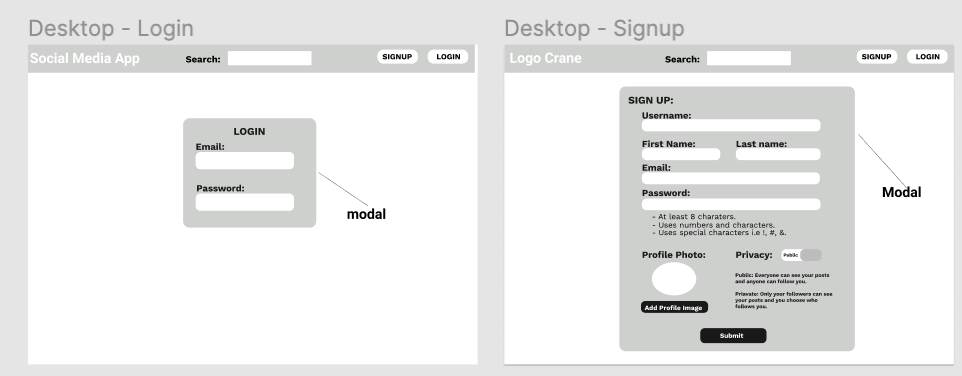
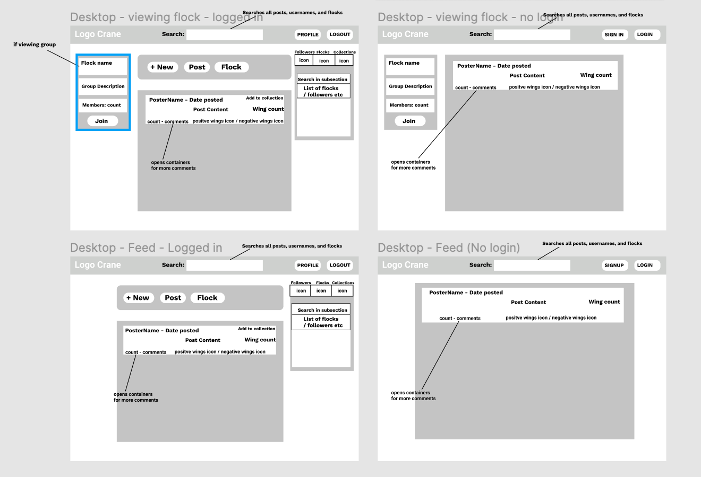
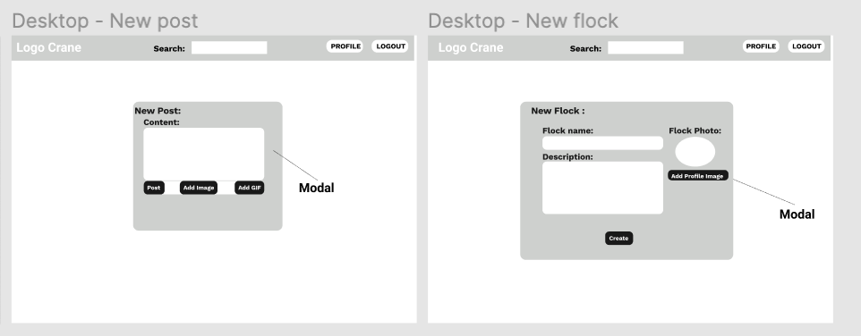
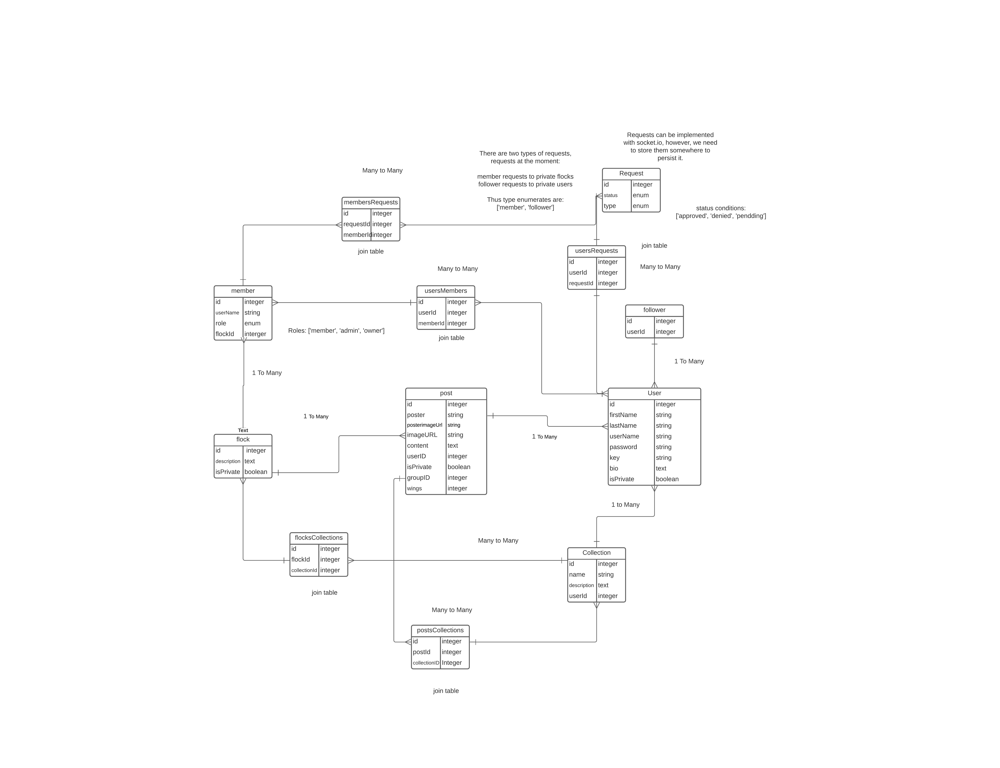

# Planning Out Crane.

## About:

Crane is a social media application that allows users to craft posts, join flocks and interact with one another. My inspirations for crane's functionality came from reddit and facebook.

Some Terminology:
- Flock - Group
- Wing(s) - basically upvotes and downvotes.

## User Stories:

### Authenication:

#### As a non-authenicated user:
- I can view the site's public content.
- I can to search for public content and users within the site get results.
- I can signup for an account.
- I cannot upvote or comment on posts without logging in.

#### As an authenicated user:
- I can create posts, flocks and interact with followers.
- I can add wings / subtract wings from posts and comments.
- I can comment on posts and comments.
- I can choose wither my posts are public or private.
- I can be either a member or an admin of a flock.
- I can create collections of flocks and posts.

### Flocks:

#### As an owner of a flock:
- Has all the benifits of being a member / admin.
- Can make other owners (max 3).
- Can demote admins and owners including myself.
- Can delete the flock.
- Can remove any member, admin or owner.

#### As an admin of a flock:
- Can remove members of a flock.
- Can delete ANY posts / comments in a flock.
- Can change properties of a flock.
- Can make other members admins.
- Can demote myself.

#### As a member of a flock:
- Can post or delete my own posts and comments in the flock.
- Can only remove myself from the flock.

#### As a non-member:
- Can join public flocks.
- Can request to join private flocks.

### Users:

#### As a follower of another user:
- I can see / search for private and public posts, but not private posts in flocks I'm not a member of.

#### Users that are not followers:
- Can follow other users that are public.
- Can request to follow other users.

#### As a public user:
- Can make posts that are all public. This includes non-users.

#### As a private user:
- Can make posts that are all private. i.e. only followers can view.

## Wireframes:

### Sign In:

### Feed:

### Making New Content:

## Data Models and ERD:

